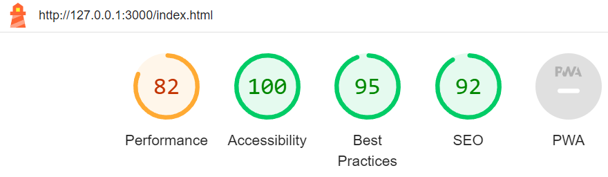
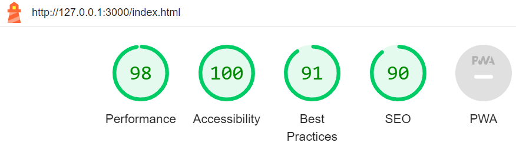

# Willow Velvet Sphynx

Willow Velvet Sphynx is a cattery that aims to better the Sphynx cat breed through responsible breeding with thorough health tests. This website is designed to promote the cattery, provide new and returning users with care advice and the means to contact the cattery for more information and/or to join a waiting list for a kitten.

---

## Contents

* [User Experience](#user-experience-ux)

  * [Site Contents](#site-contents)
  * [User Stories](#user-stories)

* [Design](#design)

  * [Imagery](#imagery)
  * [Wireframes](#wireframes)
  * [Typography](#typography)
  * [Colour Scheme](#colour-scheme)

* [Features](#features)

* [Testing](#testing)

## User Experience (UX)

### Site Contents

- A home page with information about the cattery and their goals.
- A page showcasing the queens of the cattery with links to their own dedicated page including images of their kittens.
- A FAQ page for general queries and care advice.
- A contact page for the user to get in touch for more information or to join the waiting list.

### User Stories

#### Client Goals

- To be able to view the site on a variety of device sizes.
- To promote the cattery and attract new customers.
- To provide new and returning customers information about the cattery/breed/care.
- To provide users with a means to contact the cattery.

#### First Time Visitor Goals

- As a first time visitor I want to be able to easily navigate around the site.
- As a first time visitor I want information about the cattery.
- As a first time visitor I want to see images of the cattery's queens/kittens.
- As a first time visitor I want to find the cattery's social platforms.

#### Returning Visitor Goals

- As a returning visitor I want to be able to easily contact the cattery.
- As a returning visitor I want to be able to gain answers to questions I have.
- As a returning visitor I want to know when the cattery's next litter is due.

## Content

All content used within the site was provided by Willow Velvet Sphynx cattery.

## Design

### Imagery

All imagery used within the site has been chosen to showcase the catterys queens and kittens.
All images used belong to Willow Velvet Sphynx.

### Wireframes

### Typography

The following Google Fonts were used on this site:

- Philosopher is used for the headings on the site. This is a Sans Serif font.
- Open Sans is used for the main text of the site. This is a Sans Serif font.

### Colour Scheme

A shade of blue has been used as the primary colour for the site; other than the use of black and white, this will be the only colour used throughout the site. Blue has been used because, in terms of colour psychology, it symbolises trust and responsibility, which are important to the cattery. This shade of blue also passes all contrast test when checked against white which will be the colour used against it.

## Features

The website will include a home page, a page showcasing the queens with links to their own individual pages that will include images of their kittens, an FAQ page, and a contact page.
Each page will be responsive.

### Features on Each Page

- Each page consists of a navigation bar at the top, providing easy navigation around the site. The navigation bar is responsive and adjusts to the size of the viewport. On tablet sized devices and below, the navigation bar consists of the client logo to the left and a hamburg toggle button to the right, which provides a dropdown menu with links to each of the site's pages and the client's social platforms. On devices larger than a tablet, the logo no longer displays and is replaced with the client brand name to the left and to the right, the hamburg toggle button is replaced with a set of links to the site's pages.
- Each page will consist of a footer that includes the client's social platforms and another link to the contact page. Icons have been used because they are universally recognisable and they provide better design. The footer is responsive and adjusts to the size of the viewport.

#### Home Page

- The home page consists of a heading section, which includes the caterry's name or logo depending on the viewport size and information on when the cattery's next litter is due.
- Below the heading section is an 'about us' section, which provides the user with information about the cattery.
- The next section includes images of the cattery's adult cats. On small mobile devices, only one image will show; on tablet sized devices, two images will show; and on devices larger than a tablet, three images will show.
- All sections on the page are responsive.

## Testing

### Home Page

After the home page was complete, I ran both the HTML and CSS code on the W3C code validation service and confirmed there were no errors present.
I have run Lighthouse through Google Dev Tools, and the scores the site gave were:

Mobile:

Desktop:

## Credits

- https://flexboxfroggy.com/ to help with using flexbox.
- 'Responsive Web Design with HTML5 and CSS by Ben Frain' for reference throughout the project.