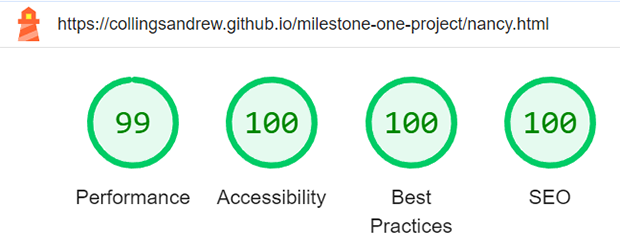
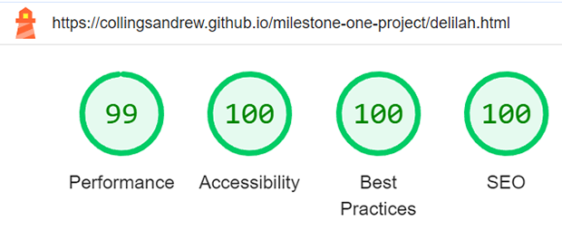
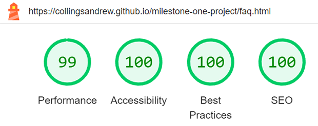
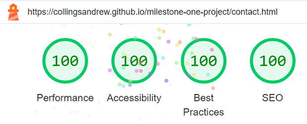

# Willow Velvet Sphynx

Willow Velvet Sphynx is a cattery that aims to improve the Sphynx cat breed through responsible breeding and thorough health tests. This website is designed to promote the cattery, showing visitors they are trustworthy, responsible, and knowledgeable, providing new and returning users with answers to various questions they may have, and providing the means to contact the cattery for more information and/or to join a waiting list for a kitten.

[View live webpage](https://collingsandrew.github.io/milestone-one-project/index.html)

---

## User Experience (UX)

### Site Contents

- A home page with information about the cattery and its goals.
- A page showcasing the queens of the cattery with links to their own dedicated page, including images of their kittens.
- A FAQ page for general queries and care advice.
- A contact page for the user to get in touch for more information or to join the waiting list.
- A confirmation page for the form.
- A 404 error page.

### Target Audience

- Fellow breeders looking for another kitten to join their own cattery.
- Customers that are interested in giving a kitten a forever home.
- New and returning customers searching for information or advice.

### Project Purpose

The purpose of this project is to create an informative yet simple, professional-looking site that shows new and returning customers why Willow Velvet Sphynx should always be their first choice when choosing a sphynx breeder. The cattery aims for all customers to have a positive experience when dealing with them, and this site will be their first experience, so it should provide just that.

### User Stories

#### Client Goals

1. To be able to view the site on a variety of device sizes.
2. To promote the cattery and attract new customers.
3. To provide new and returning customers with information about the cattery, breed, and care.
4. To provide users with a means to contact the cattery.

#### First Time Visitor Goals

5. As a first time visitor, I want to be able to easily navigate around the site.
6. As a first time visitor, I want information about the cattery.
7. As a first time visitor, I want to see images of the cattery's queens and kittens.
8. As a first time visitor, I want to find the cattery's social platforms.

#### Returning Visitor Goals

9. As a returning visitor, I want to be able to easily contact the cattery.
10. As a returning visitor, I want to be able to gain answers to questions I have.
11. As a returning visitor, I want to know when the cattery's next litter is due.

## Content

All content used within the site was provided by Willow Velvet Sphynx.

## Accessibility

The site has been built with accessibility in mind to ensure that it is always a positive experience.

This has been achieved by:
- Semantic HTML.
- Choosing fonts and colours with high contrast.
- Adequate aria-labels for interactive features.
- Adequate alt attributes for images.

## Design

### Imagery

All imagery used within the site has been chosen to showcase the cattery's queens and kittens.
All images used belong to Willow Velvet Sphynx.

### Wireframes

Home Page

Queens Page

Individual Queen Page

FAQ Page

Contact Page

Form Confirmation Page

404 Page

### Typography

The following Google Fonts were used on this site:

- Philosopher is used for the headings on the site. This is a Sans Serif font.

- Open Sans is used for the main text of the site. This is a Sans Serif font.

Both of these fonts look professional and are easy to read.

### Colour Scheme

A shade of blue has been used as the primary colour for the site; other than the use of black and white, this will be the only colour used throughout the site. Blue has been used because, in terms of colour psychology, it symbolises trust and responsibility, which are important to the cattery. This shade of blue also passes all contrast tests when checked against white, which will be the colour used against it.

## Features

### Features on Each Page

- Each page consists of a navigation bar at the top, providing easy navigation around the site. The navigation bar is responsive and adjusts to the size of the viewport. On tablet-sized devices and below, the navigation bar consists of the client logo to the left and a hamburg toggle button to the right, which provides a drop-down menu with links to each of the site's pages and the client's social platforms. On devices larger than a tablet, the logo no longer displays and is replaced with the client brand name to the left and to the right, the hamburg toggle button is replaced with a set of links to the site's pages.

Desktop:

Mobile:

- Each page will consist of a footer that includes the client's social platforms and another link to the contact page. Icons have been used because they are universally recognisable and they provide better design. The footer is responsive and adjusts to the size of the viewport.

- Each page will consist of a heading section, which includes the cattery's name or logo depending on the viewport size and the title of the page.

User stories: 1, 5, 8

### Home Page

- When the cattery's next litter is due.
- About Us section, which provides the user with information about the cattery and what they do differently.
- 3 cards, each consisting of an image, and a button that links to the Queens page, the FAQ page, and the contact page.
- All sections on the page are responsive, with the cards flowing in a column on mobile devices, a pyramid style on tablet-sized devices, and a row on devices larger than a tablet.

User stories: 1, 2, 3, 5, 6, 11

Preview

### Queens Page

- Information about the cattery's queens and the health tests the cattery carries out.
- 3 cards, each consisting of an image of each queen, the queen's name, and a button that links to their own dedicated page.
- All sections on the page are responsive, with the cards flowing in a column on mobile devices, a pyramid style on tablet-sized devices, and a row on devices larger than a tablet.

User stories: 1, 2, 3, 5, 7

Preview

### Individual Queens Pages

- Information about the queen.
- A carousel or grid of images, depending on the viewport size, with images of the queen and kittens.
- A link back to the Queens page.

User stories: 1, 2, 5, 7

Preview

### FAQ Page

- An accordion that consists of multiple questions and answers.

User stories: 1, 3, 6, 10

Preview

### Contact Page

- A form that allows the user to contact the cattery.

User stories: 4, 9, 10

Preview

## Deployment

### Deploying the project

GitHub pages were used to deploy this project. The following steps explain how this is done:

1. When logged into GitHub, locate and access the [repository.](https://github.com/collingsandrew/milestone-one-project)
2. Click on the settings link that is located at the top of the repository.
3. Using the menu to the left, follow the pages link.
4. Here, we then need to make sure the source drop-down box is set to 'deploy from branch'.
5. Finally, we set the branch to 'main' and the folder to 'root', and then click save.

The page should then refresh, and the link to the deployed website should appear at the top of the page.

### Fork

Forking a project creates a completely separate codebase and allows a user to make local changes to a project without affecting the original repository itself.

To fork the repository:

1. When logged into GitHub, locate and access the [repository.](https://github.com/collingsandrew/milestone-one-project)
2. At the top right of the repository, there will be a 'fork' option.

### Clone

Cloning a project allows a user to make contributions to the main repository, with permission.

To clone the repository:

1. When logged into GitHub, locate and access the [repository.](https://github.com/collingsandrew/milestone-one-project)
2. Above your files to the right, select the code drop down button and select either HTTPS, SSH or GitHub CLI and then copy the URL below.
3. Then, in your chosen code editor, change the current working directory to the location you would like the cloned repository to be located.
4. In the terminal, type 'git clone' and paste the URL that you copied earlier, and then press enter.

## Testing

### Devices

Google Developer Tools was used to test the site on various device sizes.

The following devices were used to test the site:
- 32" (3840 x 2160) Desktop Monitor
- 15.6" (1920 x 1080) ASUS Laptop
- iPad Tablet
- Samsung S23 Mobile
- iPhone 12 Mobile

### Browsers

The following browsers were used to test the site:
- Google Chrome
- Mozilla Firefox
- Safari

### Code Validation

#### HTML Validation

[W3C Markup Validation Service](https://validator.w3.org/) was used to validate the HTML. All pages passed with no errors.

[index.html results](https://validator.w3.org/nu/?doc=https%3A%2F%2Fcollingsandrew.github.io%2Fmilestone-one-project%2Findex.html)

[queens.html results](https://validator.w3.org/nu/?doc=https%3A%2F%2Fcollingsandrew.github.io%2Fmilestone-one-project%2Fqueens.html)

[nancy.html results](https://validator.w3.org/nu/?doc=https%3A%2F%2Fcollingsandrew.github.io%2Fmilestone-one-project%2Fnancy.html)

[beatrice.html results](https://validator.w3.org/nu/?doc=https%3A%2F%2Fcollingsandrew.github.io%2Fmilestone-one-project%2Fbeatrice.html)

[delilah.html results](https://validator.w3.org/nu/?doc=https%3A%2F%2Fcollingsandrew.github.io%2Fmilestone-one-project%2Fdelilah.html)

[faq.html results](https://validator.w3.org/nu/?doc=https%3A%2F%2Fcollingsandrew.github.io%2Fmilestone-one-project%2Ffaq.html)

[contact.html results](https://validator.w3.org/nu/?doc=https%3A%2F%2Fcollingsandrew.github.io%2Fmilestone-one-project%2Fcontact.html)

#### CSS Validation

[W3C CSS Validation Service](https://jigsaw.w3.org/css-validator/) was used to validate my own custom CSS. No errors were found.

### Lighthouse Testing

Google Lighthouse was used to test all pages. All pages performed well.

#### index.html

Mobile

Desktop

#### queens.html

Mobile

Desktop

#### nancy.html

Mobile

Desktop

#### beatrice.html

Mobile

Desktop

#### delilah.html

Mobile

Desktop

#### faq.html

Mobile

Desktop

#### contact.html

Mobile

Desktop

#### confirmation.html

Mobile

Desktop

### Accessibility Testing

[WAVE Web Accessibility Tool](https://wave.webaim.org/) was used to test for accessibility errors. All pages passed with no errors and no contrast errors.

[index.html results](https://wave.webaim.org/report#/https://collingsandrew.github.io/milestone-one-project/index.html)

[queens.html results](https://wave.webaim.org/report#/https://collingsandrew.github.io/milestone-one-project/queens.html)

[nancy.html results](https://wave.webaim.org/report#/https://collingsandrew.github.io/milestone-one-project/nancy.html)

[beatrice.html results](https://wave.webaim.org/report#/https://collingsandrew.github.io/milestone-one-project/beatrice.html)

[delilah.html results](https://wave.webaim.org/report#/https://collingsandrew.github.io/milestone-one-project/delilah.html)

[faq.html results](https://wave.webaim.org/report#/https://collingsandrew.github.io/milestone-one-project/faq.html)

[contact.html results](https://wave.webaim.org/report#/https://collingsandrew.github.io/milestone-one-project/contact.html)

[confirmation.html results](https://wave.webaim.org/report#/https://collingsandrew.github.io/milestone-one-project/confirmation.html?)

[404.html results](https://wave.webaim.org/report#/https://collingsandrew.github.io/milestone-one-project/confirmation.h)

### Testing User Stories

#### Client Goals

1. To be able to view the site on a variety of device sizes.
    * All features within the site are responsive on all device sizes.
    * The navbar changes from a hamburg toggle menu on mobile and tablet devices to a generic navbar with links on laptop and desktop devices.
    * The layout of features changes from a column on mobile devices to a row on desktop or laptop devices.

2. To promote the cattery and attract new customers.
    * The site is structured well for the user to easily navigate and obtain what they need from the site.
    * A professional but simple look to not overwhelm the user and to prevent the user from leaving the site.
    * The content within the site has been used to promote the cattery with short snippets of text to not overwhelm the user.

3. To provide new and returning customers with information about the cattery, breed, and care.
    * The home page provides an 'About Us' section that gives the user information about the cattery.
    * The FAQ page provides the user with multiple questions and answers relating to the cattery, breed, and care.

4. To provide users with a means to contact the cattery.
    * The contact page provides the user with the means to contact the cattery by filling out a form.
    * Social links that allow users to visit the cattery's social platforms and contact them through them.

#### First Time Visitor Goals

5. As a first time visitor, I want to be able to easily navigate around the site.
    * The site is structured well for the user to easily navigate around the site.
    * A simple navbar with links on laptop and desktop devices.
    * A navbar with the common hamburg toggle menu on mobile and tablet devices.

6. As a first time visitor, I want information about the cattery.
    * The home page provides an 'About Us' section that gives the user information about the cattery.
    * The FAQ page provides the user with multiple questions and answers relating to the cattery.

7. As a first time visitor, I want to see images of the cattery's queens and kittens.
    * The individual queens pages provide images of the queens and their kittens.
    * Bootstrap cards have been used, which include an image of the cattery's queens.

8. As a first time visitor, I want to find the cattery's social platforms.
    * The footer includes links to the cattery's social platforms.
    * On mobile devices, the hamburg toggle menu includes links to the cattery's social platforms.

#### Returning Visitor Goals

9. As a returning visitor, I want to be able to easily contact the cattery.
    * The contact page provides the user with the means to contact the cattery by filling out a form.
    * Social links that allow users to visit the cattery's social platforms and contact them through there.

10. As a returning visitor, I want to be able to gain answers to questions I have.
    * The FAQ page provides the user with multiple questions and answers.
    * The site includes information that could answer questions users may have.
    * The contact page provides the user with the means to contact the cattery through a form to ask unanswered questions.

11. As a returning visitor, I want to know when the cattery's next litter is due.
    * The heading of the home page provides the user with information on when the cattery's next litter is due.

### Functionality Testing

#### Site Page Load

| Action                        | Expected Result    | Pass/Fail|
| ----------------------------- |--------------------|----------|
| Site URL entered into browser | Site loads         | Pass     |

#### index.html

| Action                                | Expected Result                | Pass/Fail      |
| --------------------------------------|--------------------------------|----------------|
| Load page                             | Page loads                     | Pass           |
| Click Queens link (navbar)            | Go to queens.html              | Pass           |
| Click FAQ link (navbar)               | Go to faq.html                 | Pass           |
| Click Contact link (navbar)           | Go to contact.html             | Pass           |
| Click Facebook link (mobile menu)     | Go to Facebook page in new tab | Pass           |
| Click Instagram link (mobile menu)    | Go to Instagram page in new tab| Pass           |
| Click Queens link (card)              | Go to queens.html              | Pass           |
| Click FAQ link (card)                 | Go to faq.html                 | Pass           |
| Click Contact link (card)             | Go to contact.html             | Pass           |
| Click Facebook icon (footer)          | Go to Facebook page in new tab | Pass           |
| Click Instagram icon (footer)         | Go to Instagram page in new tab| Pass           |
| Click envelope icon (footer)          | Go to contact.html             | Pass           |

#### queens.html

| Action                                            | Expected Result                | Pass/Fail      |
| --------------------------------------------------|--------------------------------|----------------|
| Load page                                         | Page loads                     | Pass           |
| Click navbar heading/logo                         | Go to index.html               | Pass           |
| Click Home link (navbar)                          | Go to index.html               | Pass           |
| Click FAQ link (navbar)                           | Go to faq.html                 | Pass           |
| Click Contact link (navbar)                       | Go to contact.html             | Pass           |
| Click Facebook link (mobile menu)                 | Go to Facebook page in new tab | Pass           |
| Click Instagram link (mobile menu)                | Go to Instagram page in new tab| Pass           |
| Click Find Out More About Me link (Nancy card)    | Go to nancy.html               | Pass           |
| Click Find Out More About Me link (Beatrice card) | Go to beatrice.html            | Pass           |
| Click Find Out More About Me link (Delilah card)  | Go to delilah.html             | Pass           |
| Click Facebook icon (footer)                      | Go to Facebook page in new tab | Pass           |
| Click Instagram icon (footer)                     | Go to Instagram page in new tab| Pass           |
| Click envelope icon (footer)                      | Go to contact.html             | Pass           |

#### nancy.html

| Action                                | Expected Result                     | Pass/Fail      |
| --------------------------------------|-------------------------------------|----------------|
| Load page                             | Page loads                          | Pass           |
| Click navbar heading/logo             | Go to index.html                    | Pass           |
| Click Home link (navbar)              | Go to index.html                    | Pass           |
| Click Queens link (navbar)            | Go to queens.html                   | Pass           |
| Click FAQ link (navbar)               | Go to faq.html                      | Pass           |
| Click Contact link (navbar)           | Go to contact.html                  | Pass           |
| Click Facebook link (mobile menu)     | Go to Facebook page in new tab      | Pass           |
| Click Instagram link (mobile menu)    | Go to Instagram page in new tab     | Pass           |
| Click carousel controls               | Scroll left and right through images| Pass           |
| Click Go Back To Our Queens Page link | Go to queens.html                   | Pass           |
| Click Facebook icon (footer)          | Go to Facebook page in new tab      | Pass           |
| Click Instagram icon (footer)         | Go to Instagram page in new tab     | Pass           |
| Click envelope icon (footer)          | Go to contact.html                  | Pass           |

#### beatrice.html

| Action                                | Expected Result                     | Pass/Fail      |
| --------------------------------------|-------------------------------------|----------------|
| Load page                             | Page loads                          | Pass           |
| Click navbar heading/logo             | Go to index.html                    | Pass           |
| Click Home link (navbar)              | Go to index.html                    | Pass           |
| Click Queens link (navbar)            | Go to queens.html                   | Pass           |
| Click FAQ link (navbar)               | Go to faq.html                      | Pass           |
| Click Contact link (navbar)           | Go to contact.html                  | Pass           |
| Click Facebook link (mobile menu)     | Go to Facebook page in new tab      | Pass           |
| Click Instagram link (mobile menu)    | Go to Instagram page in new tab     | Pass           |
| Click carousel controls               | Scroll left and right through images| Pass           |
| Click Go Back To Our Queens Page link | Go to queens.html                   | Pass           |
| Click Facebook icon (footer)          | Go to Facebook page in new tab      | Pass           |
| Click Instagram icon (footer)         | Go to Instagram page in new tab     | Pass           |
| Click envelope icon (footer)          | Go to contact.html                  | Pass           |

#### delilah.html

| Action                                | Expected Result                     | Pass/Fail      |
| --------------------------------------|-------------------------------------|----------------|
| Load page                             | Page loads                          | Pass           |
| Click navbar heading/logo             | Go to index.html                    | Pass           |
| Click Home link (navbar)              | Go to index.html                    | Pass           |
| Click Queens link (navbar)            | Go to queens.html                   | Pass           |
| Click FAQ link (navbar)               | Go to faq.html                      | Pass           |
| Click Contact link (navbar)           | Go to contact.html                  | Pass           |
| Click Facebook link (mobile menu)     | Go to Facebook page in new tab      | Pass           |
| Click Instagram link (mobile menu)    | Go to Instagram page in new tab     | Pass           |
| Click carousel controls               | Scroll left and right through images| Pass           |
| Click Go Back To Our Queens Page link | Go to queens.html                   | Pass           |
| Click Facebook icon (footer)          | Go to Facebook page in new tab      | Pass           |
| Click Instagram icon (footer)         | Go to Instagram page in new tab     | Pass           |
| Click envelope icon (footer)          | Go to contact.html                  | Pass           |

#### faq.html

| Action                                | Expected Result                     | Pass/Fail      |
| --------------------------------------|-------------------------------------|----------------|
| Load page                             | Page loads                          | Pass           |
| Click navbar heading/logo             | Go to index.html                    | Pass           |
| Click Home link (navbar)              | Go to index.html                    | Pass           |
| Click Queens link (navbar)            | Go to queens.html                   | Pass           |
| Click Contact link (navbar)           | Go to contact.html                  | Pass           |
| Click Facebook link (mobile menu)     | Go to Facebook page in new tab      | Pass           |
| Click Instagram link (mobile menu)    | Go to Instagram page in new tab     | Pass           |
| Click accordion drop down buttons     | Text drops down                     | Pass           |
| Click Facebook icon (footer)          | Go to Facebook page in new tab      | Pass           |
| Click Instagram icon (footer)         | Go to Instagram page in new tab     | Pass           |
| Click envelope icon (footer)          | Go to contact.html                  | Pass           |
| Click play on YouTube video           | Video plays                         | Pass           |
| Click controls on YouTube video       | All controls to work                | Pass           |

#### contact.html

| Action                                | Expected Result                     | Pass/Fail      |
| --------------------------------------|-------------------------------------|----------------|
| Load page                             | Page loads                          | Pass           |
| Click navbar heading/logo             | Go to index.html                    | Pass           |
| Click Home link (navbar)              | Go to index.html                    | Pass           |
| Click Queens link (navbar)            | Go to queens.html                   | Pass           |
| Click FAQ link (navbar)               | Go to faq.html                      | Pass           |
| Click Facebook link (mobile menu)     | Go to Facebook page in new tab      | Pass           |
| Click Instagram link (mobile menu)    | Go to Instagram page in new tab     | Pass           |
| Click Facebook icon (footer)          | Go to Facebook page in new tab      | Pass           |
| Click Instagram icon (footer)         | Go to Instagram page in new tab     | Pass           |
| Click envelope icon (footer)          | Go to contact.html                  | Pass           |

##### Form

| Action                                                     | Expected Result         | Pass/Fail      |
| -----------------------------------------------------------|-------------------------|----------------|
| Click submit button when all fields are filled in correctly| Go to confirmation.html | Pass           |
| Click submit button when name field is empty               | Error message           | Pass           |
| Click submit button when email field is empty              | Error message           | Pass           |
| Click submit button when text area field is empty          | Error message           | Pass           |

#### confirmation.html

| Action                                | Expected Result                     | Pass/Fail      |
| --------------------------------------|-------------------------------------|----------------|
| Load page                             | Page loads                          | Pass           |
| Click navbar heading/logo             | Go to index.html                    | Pass           |
| Click Home link (navbar)              | Go to index.html                    | Pass           |
| Click Queens link (navbar)            | Go to queens.html                   | Pass           |
| Click FAQ link (navbar)               | Go to faq.html                      | Pass           |
| Click Contact link (navbar)           | Go to contact.html                  | Pass           |
| Click Facebook link (mobile menu)     | Go to Facebook page in new tab      | Pass           |
| Click Instagram link (mobile menu)    | Go to Instagram page in new tab     | Pass           |
| Click Go Back To The Home Page link   | Go to index.html                    | Pass           |
| Click Facebook icon (footer)          | Go to Facebook page in new tab      | Pass           |
| Click Instagram icon (footer)         | Go to Instagram page in new tab     | Pass           |
| Click envelope icon (footer)          | Go to contact.html                  | Pass           |

#### 404.html

| Action                                | Expected Result                     | Pass/Fail      |
| --------------------------------------|-------------------------------------|----------------|
| Load page                             | Page loads                          | Pass           |
| Click navbar heading/logo             | Go to index.html                    | Pass           |
| Click Home link (navbar)              | Go to index.html                    | Pass           |
| Click Queens link (navbar)            | Go to queens.html                   | Pass           |
| Click FAQ link (navbar)               | Go to faq.html                      | Pass           |
| Click Contact link (navbar)           | Go to contact.html                  | Pass           |
| Click Facebook link (mobile menu)     | Go to Facebook page in new tab      | Pass           |
| Click Instagram link (mobile menu)    | Go to Instagram page in new tab     | Pass           |
| Click Go Back To The Home Page link   | Go to index.html                    | Pass           |
| Click Facebook icon (footer)          | Go to Facebook page in new tab      | Pass           |
| Click Instagram icon (footer)         | Go to Instagram page in new tab     | Pass           |
| Click envelope icon (footer)          | Go to contact.html                  | Pass           |

## Bugs

### Fixed

- When adding the accordion to the FAQ page, there were gaps between each accordion item. This was happening because the h2 elements within the accordion button were inheriting the h2 styling from the CSS stylesheet. To fix this, I used specificity to focus on h2 elements that are a child of the 'accordion' class and removed the margins affecting them.

Before:

After:

- When testing the deployed site on the Safari browser, the input submit button for the contact form was displaying differently than it was on other browsers. I wanted a consistent design throughout the site, so I changed the input element to a button element with the 'type' attribute as 'submit'. This enabled me to style the button in line with the design of the rest of the site and also stop the design from changing on different browsers.

Before:

After:

## Technologies Used

- [Balsamiq](https://balsamiq.com/wireframes/)
- [Bootstrap v5.3.2](https://getbootstrap.com/)
- [Tiny PNG](https://tinypng.com/)
- [Adobe Photoshop](https://www.adobe.com/uk/)
- [Google Fonts](https://fonts.google.com/about)
- [Git](https://git-scm.com/)
- [Github](https://github.com/)
- [Visual Studio Code](https://code.visualstudio.com/)
- [Favicon](https://favicon.io/)
- [Jira Software](https://willowvelvet.atlassian.net/jira/software/projects/WVS/boards/2)
- [Am I Responsive](https://ui.dev/amiresponsive)
- [YouTube](https://www.youtube.com/)

### Languages

- HTML
- CSS

## Credits

### Acknowledgements

- My mentor for guidance throughout the project.
- My cohort for help and support throughout the project.
- Code Institute for their course material.

### Code Used

- Navbar - [from the Bootstrap 5 Docs.](https://getbootstrap.com/docs/5.0/components/navbar/)
- Cards - [from the Bootstrap 5 Docs.](https://getbootstrap.com/docs/5.0/components/card/)
- Carousels - [from the Bootstrap 5 Docs.](https://getbootstrap.com/docs/5.0/components/carousel/)
- Grid layout for the queens images - [from the Bootstrap 5 Docs.](https://getbootstrap.com/docs/5.0/layout/grid/)
- Accordion - [from the Bootstrap 5 Docs.](https://getbootstrap.com/docs/5.0/components/accordion/)

### Resources

- [Flexbox Froggy](https://flexboxfroggy.com/) to help with using flexbox.
- [Responsive Web Design with HTML5 and CSS by Ben Frain](https://benfrain.com/books/responsive-web-design-with-html5-and-css-4th-edition/) for reference throughout the project.
- [Bootstrap 5 documentation](https://getbootstrap.com/docs/5.0/getting-started/introduction/) to assist with implementing the bootstrap components.
- [W3Schools](https://www.w3schools.com/) for reference throughout the project.